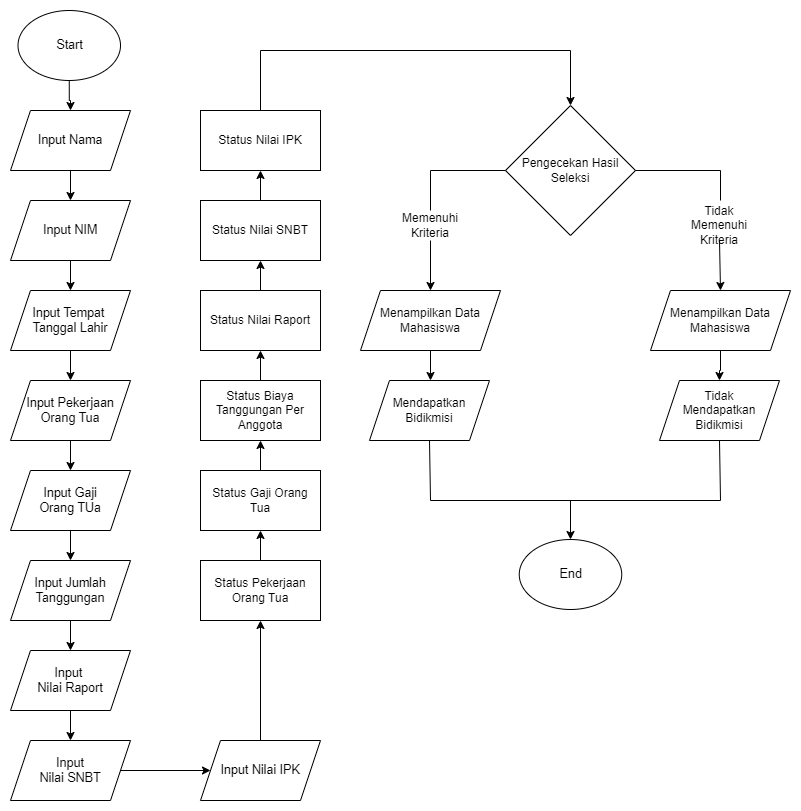

# SELEKSI BIDIKMISI MAHASISWA

## STUDI KASUS
Ukt (Uang Kuliah Tunggal) adalah biaya yang diberikan universitas kepada mahasiswa sebagai biaya belajar selama satu sememster pembelajaran. Biasanya universitas negeri yang menetapkan ukt karena mendapatkan subsidi dari pemerintah sehingga perhitungan dibulatkan menjadi beberapa golongan, berbeda dengan universitas swasta dimana biaya dimasing-masingkan sendiri.
Pemerintah juga memperhatikan mahasiswa yang memiliki kekurangan finansial. Sehingga dibentuk program bidikmisi sebagai peringanan biaya kuliah.
Tentunya ada syarat tertentu mahasiswa bisa mendapatkan bidikmisi. Dengan alasan tersebut, program python ini dibuat untuk menseleksi mahasiswa yang berhak dan tidak berhak mendapatkan bidikmisi.

## FLOWCHART

## PENJELASAN PROGRAM PYTHON
1. Program dimulai.
2. Kode akan mulai berjalan dengan memberikan inputan berupa nama, umur, dan seterusnya hingga nilai IPK yang harus diisi oleh user.
3. kode akan memproses inputan dengan memberikan nilai True atau False sebagai hasil proses.
4. Pada baris Hasil Seleksi, variabel hasil_seleksi akan memproses hasil pada proses inputan yang kemudian menentukan apakah user berhak menerima bidikmisi atau tidak.
5. Kode akan menampilkan data mahasiswa berupa nama, umur, dan tempat tanggal, dan;
6. Kode akan menampilkan hasil dari proses Hasil Seleksi.
7. Program selesai.

## PENJELASAN PROSES SELEKSI DAN HASIL SELEKSI
1. Pekerjaan orang tua tidak boleh dokter, tni, pns, dan guru.
2. Gaji orang tua harus lebih kecil sama dengan Rp 2.500.000 .
3. Biaya Tanggungan per Anggota harus lebih kecil sama dengan Rp 800.000 .
4. Untuk jalur SNBP, nilai raport harus lebih besar sama dengan 87 (skala 100).
5. Untuk jalur SNBT, nilai SNBT harus lebih besar sama dengan 605 (skala 1000).
6. Untuk Mahasiswa semester 3 keatas, nilai IPK harus lebih besar sama dengan 3.2 (skala 4).
7. Untuk gaji dan biaya tanggungan akan diberi operasi logika 'or'. Jika gaji tergolong besar (misalkan 6 juta) tetapi dengan tanggungan yang besar juga (misal 8 anak dan 1 ibu) maka akan tetap lolos karena biaya tanggungan per anggota terlalu kecil.
8. Untuk nilai raport, SNBT, dan IPK akan diberi operator logika 'or'. Sehingga nilai akan diambil yang diberi input bukan 0.